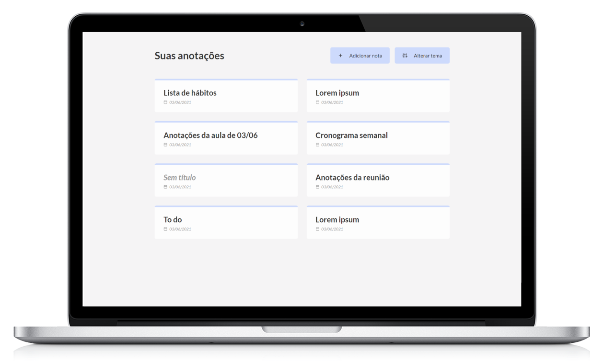
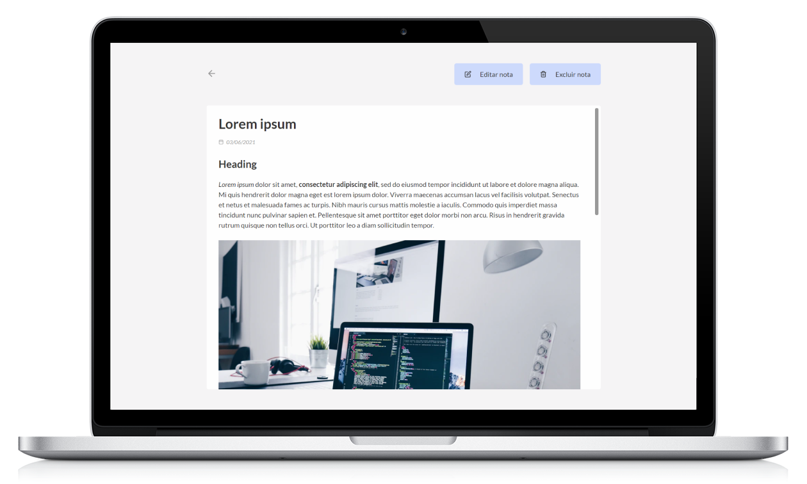
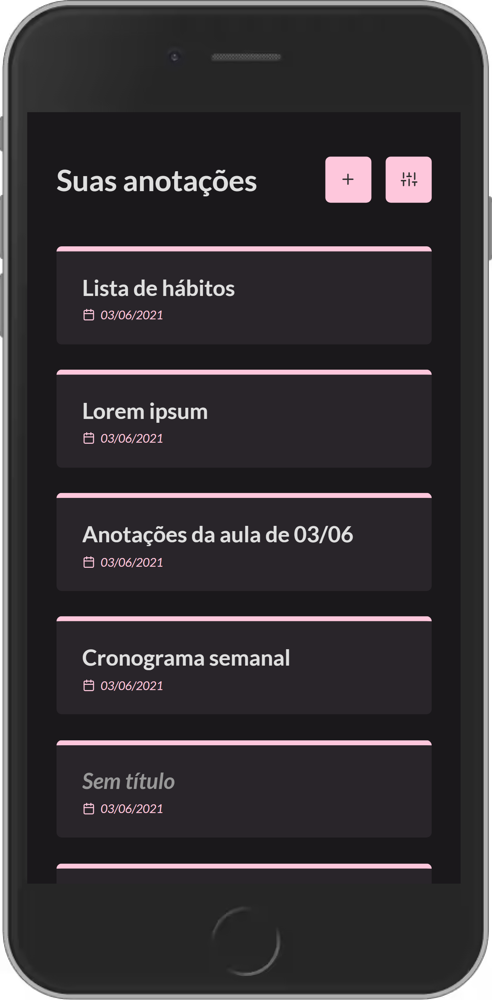
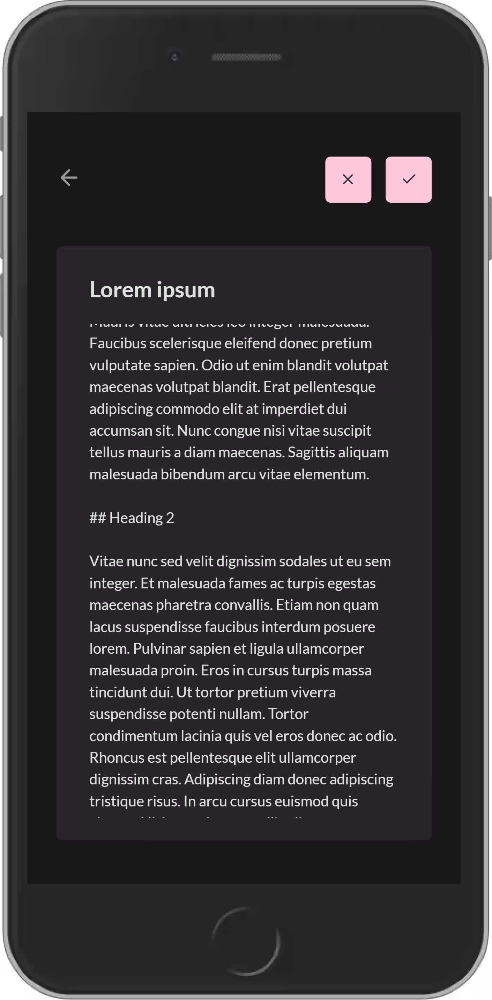

<h1 align="center">🗒 Notes App 🗒</h1>
<p align="center">Aplicação web de anotações feita com React</p>

<p align="center">
  <a href="#-sobre-o-projeto">Sobre</a> •
  <a href="#-funcionalidades">Funcionalidades</a> •
  <a href="#-layout">Layout</a> •
  <a href="#-como-executar">Como executar</a> •
  <a href="#-tecnologias">Tecnologias</a>
</p>

## 🖥 Sobre o projeto

O projeto consiste numa aplicação web responsiva para salvar anotações que ficam salvas no local storage do dispositivo. É possível, ainda, utilizar Markdown para estilizar as notas.

[Link de acesso à aplicação](https://notesapp-dev.netlify.app/)

## ⚙ Funcionalidades

- [x] Adicionar anotação
- [x] Visualizar anotação
- [x] Editar anotação
- [x] Excluir anotação
- [x] Alterar tema

## 🎨 Layout

**Versão desktop**

<p align="center" style="display: flex; flex-wrap: wrap;">
  
  
</p>

**Versão mobile**

<p align="center" style="display: flex; flex-wrap: wrap;">
  
  
</p>

## 🚀 Como executar

### Pré-requisitos

Para rodar o projeto em ambiente de desenvolvimento na sua máquina, é preciso ter instalado o Git e o Node.js.

```bash
# Digite no terminal
git clone https://github.com/fabianapduarte/notes-app.git

# Acesse a pasta do projeto
cd notes-app

# Instale as dependências do projeto
npm install

# Execute o projeto em modo de desenvolvimento
npm run start

# O projeto será aberto em uma nova guia
# Acesse localhost:3000/
```

## 🛠 Tecnologias

- ReactJS + Typescript
- React Remark
- React Router Dom
- React Icons
- date-fns

---
Feito com ❤ por Fabiana Pereira.